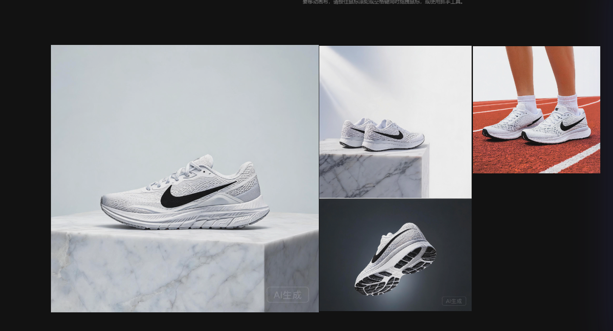
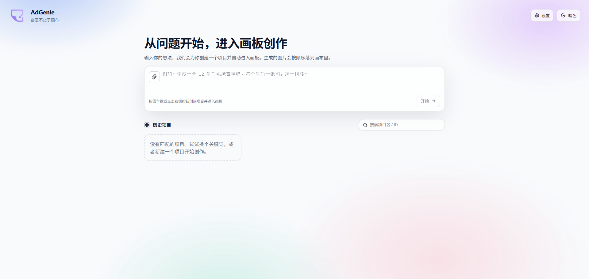
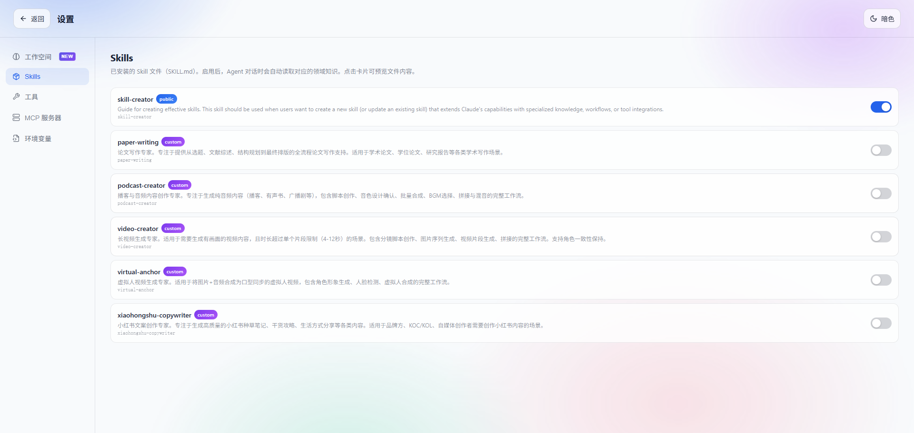
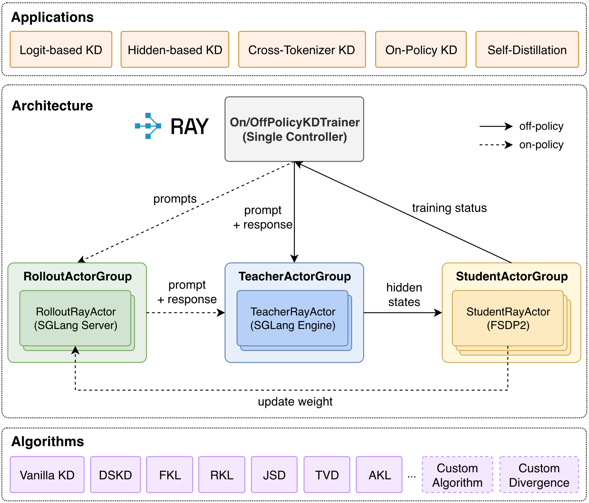

# AdGenie

<p align="center">
  
</p>

<p align="center">
  面向电商 feed 图/视频生产场景的多模态 AI 内容创作 Agent
</p>

<p align="center">
  
  
  
  
</p>

基于 LangGraph ReAct Agent 把图像生成编辑、图文转视频、3D 模型生成、多语言语音克隆、多模态理解等 20 类工具链式自动调度，一次对话即可完成素材理解 → 生成 → 后处理 → 输出的全流程，替代传统电商生图/生视频工具"单一 API、手动拼接"的碎片化操作方式。

## 目录

- [AdGenie](#adgenie)
  - [目录](#目录)
  - [界面预览](#界面预览)
  - [功能特性](#功能特性)
  - [项目结构](#项目结构)
  - [模型蒸馏降本（OPD）](#模型蒸馏降本opd)
  - [快速开始](#快速开始)
    - [环境要求](#环境要求)
    - [后端](#后端)
    - [前端](#前端)
    - [使用](#使用)
  - [技术栈](#技术栈)
  - [常见问题](#常见问题)

## 界面预览

<p align="center">
  
</p>

| 首页 / 创建项目 | 技能面板 |
|---|---|
|  |  |

## 功能特性

- **多工具链式调度**：LangGraph ReAct Agent 自主拆解任务，覆盖图像、视频、3D、语音、多模态理解 5 大模态，单请求最高支持 200 步递归推理，可自动完成 5-15 次连续链式任务
- **流式增量渲染**：`StreamProcessor` 对工具调用参数分片实时解析，无需等待工具执行完成即可展示内容；SSE 主推流 + WebSocket 广播双通道，保障多终端同步
- **轻量化技能加载**：仅预加载技能元数据，运行时动态调取完整规则，单轮技能 Token 消耗从 12000 压缩到 300；内置 6 项可运行时启停的自定义创作技能
- **模型蒸馏降本**：基于 OPD 在线策略蒸馏 + SpanCTKD 跨分词器知识对齐，把编排 Agent、图片理解、TTS、视频脚本等角色管线从大模型蒸馏为小模型，ModelRouter 运行时智能路由，复杂场景自动回退大模型兜底
- **媒体后处理**：sRGB 色彩归一化、3D 模型贴图路径修复、视频无损级联剪辑、音频多段拼接与 BGM 混音
- **跨会话记忆**：记忆读写工具自动留存用户创作偏好，分层截断策略实现无向量数据库的上下文延续
- **无限画布前端**：Excalidraw + Three.js，素材可视化预览与异步媒体队列缓冲；LLM 层工厂模式适配多模型服务商

## 项目结构

```
code/
├── agent/
│   ├── backend/        # FastAPI + LangGraph ReAct Agent
│   │   └── app/
│   │       ├── routers/    # API 路由（chat、settings）
│   │       ├── services/   # Agent 编排、流式处理、历史/工作区/技能服务
│   │       ├── tools/       # 图像/视频/3D/语音/理解等 LangChain 工具
│   │       └── utils/       # 日志、人脸检测等工具
│   └── frontend/       # React + Excalidraw 无限画布前端
└── OPD/                 # 跨分词器在线策略蒸馏训练框架（AdGenie 模型降本方案）
```

## 模型蒸馏降本（OPD）

线上推理成本高昂的编排 Agent / 图片理解 / TTS / 视频脚本等角色管线，通过 [`OPD/`](OPD) 训练框架蒸馏为可独立部署的小模型：Teacher/Student 双 Actor 通过 Ray 分布式调度，支持在线策略（on-policy）与离线策略（off-policy）两种蒸馏模式，并用 SpanCTKD 解决教师/学生分词器不一致的跨分词器知识对齐问题；蒸馏后由 `ModelRouter` 在运行时按场景复杂度自动路由，复杂请求兜底回退大模型。

<p align="center">
  
</p>

## 快速开始

### 环境要求

| 依赖 | 版本 |
|------|------|
| Python | 3.9+（推荐 3.11） |
| Node.js | 18+（推荐 20+） |

### 后端

```bash
cd agent/backend

# 建议使用虚拟环境
python -m venv .venv
.venv\Scripts\activate        # Windows
# source .venv/bin/activate   # macOS / Linux

pip install -r requirements.txt

# 配置环境变量
cp env.example .env
# 编辑 .env，填入 LLM / 图片生成 / 视频生成等 API Key
```

**必需环境变量**（详见 `env.example`）：

| 变量 | 说明 |
|------|------|
| `LLM_PROVIDER` | `volcano`（火山引擎）或 `siliconflow` |
| `VOLCANO_API_KEY` | 火山引擎 API Key（图片/视频生成 + LLM） |
| `VOLCANO_IMAGE_MODEL` / `VOLCANO_VIDEO_MODEL` / `VOLCANO_MODEL_NAME` | 对应模型名 |

启动服务：

```bash
python -m uvicorn app.main:app --reload --host 0.0.0.0 --port 8000
```

验证：`curl http://localhost:8000/health` 应返回 `{"status":"ok"}`。

### 前端

```bash
cd agent/frontend
npm install
npm run dev
```

浏览器打开 `http://localhost:3000`。

### 使用

在聊天框输入创作需求（例如"生成一张赛博朋克风格的都市夜景 feed 图"），Agent 会自主拆解任务并调用工具生成内容，结果自动插入画布。

## 技术栈

- **后端**：FastAPI、LangGraph、LangChain、Uvicorn
- **前端**：React、TypeScript、Vite、Excalidraw、Three.js (`@react-three/fiber`)
- **模型蒸馏**：Ray、跨分词器知识对齐（SpanCTKD）、在线策略蒸馏（OPD）

## 常见问题

排查步骤和更多细节见各模块内的文档；启动报错、依赖问题等可参考 `agent/backend` 下的日志输出（`logs/`）。
